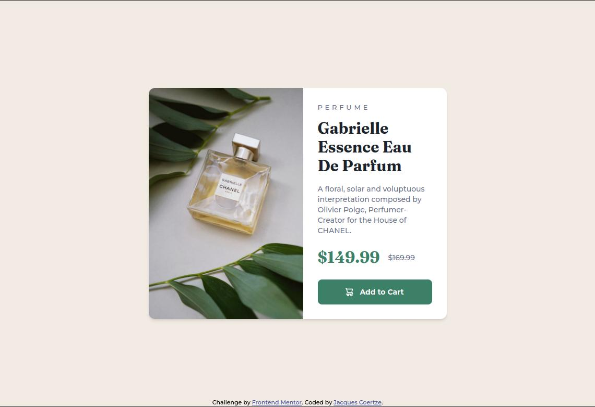

# Frontend Mentor - Product preview card component solution

This is a solution to the [Product preview card component challenge on Frontend Mentor](https://www.frontendmentor.io/challenges/product-preview-card-component-GO7UmttRfa). Frontend Mentor challenges help you improve your coding skills by building realistic projects.

## Table of contents

- [Overview](#overview)
  - [The challenge](#the-challenge)
  - [Screenshot](#screenshot)
  - [Links](#links)
- [My process](#my-process)
  - [Built with](#built-with)
  - [What I learned](#what-i-learned)
  - [Useful resources](#useful-resources)
- [Author](#author)
- [Acknowledgments](#acknowledgments)

**Note: Delete this note and update the table of contents based on what sections you keep.**

## Overview

### The challenge

Users should be able to:

- View the optimal layout depending on their device's screen size
- See hover and focus states for interactive elements

### Screenshot

#### Desktop Version



#### Mobile Version


### Links

- Solution URL: [https://github.com/Tripex48/FEM_Product-preview-card-component-tailwind](https://github.com/Tripex48/FEM_Product-preview-card-component-tailwind)
- Live Site URL: [https://Tripex48.github.io/FEM_Product-preview-card-component-tailwind](https://Tripex48.github.io/FEM_Product-preview-card-component-tailwind)

## My process

### Built with

- Semantic HTML5 markup
- Tailwind CSS
- Grid & Flexbox
- Mobile-first workflow

### What I learned

I learned about the HTML `<picture>` tag and how it gives web developers flexibility in specfying image resources. Instead of having one image that is scaled up or down based on the viewport width, multiple images can be designed to more nicely fill the browser viewport.

```html
<picture>
  <source media="(max-width:650px)" srcset="image-product-mobile.jpg" />
  
</picture>
```

### Useful resources

- [CSS reset](https://piccalil.li/blog/a-modern-css-reset/) - A great modern CSS reset that ensures a clean (default) start to any web development project.
- [Learn flexbox the easy way](https://www.youtube.com/watch?v=u044iM9xsWU) - A video from Kevin Powell discussing the properties and workings of CSS Flexbox.

## Author

- Frontend Mentor - [@Tripex48](https://www.frontendmentor.io/profile/Tripex48)
- Twitter - [@jcoertze](https://www.twitter.com/jcoertze)

## Acknowledgments

Thank you to FrontEnd Mentor for providing this challenge.
